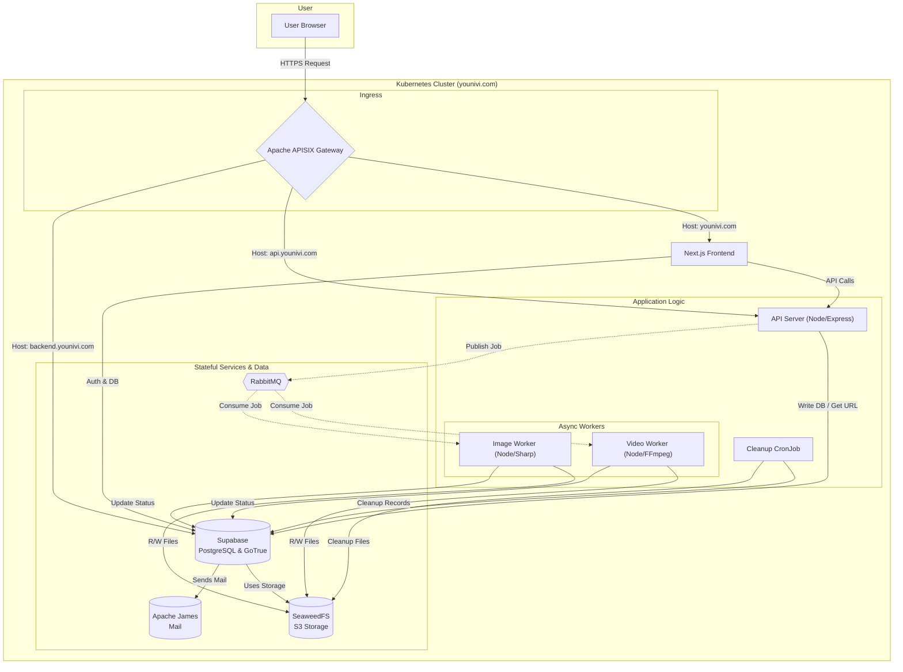
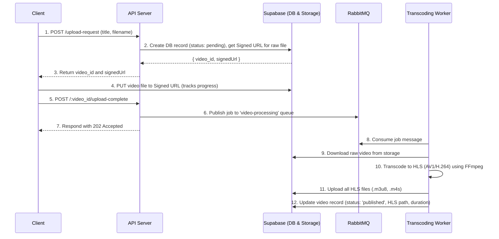
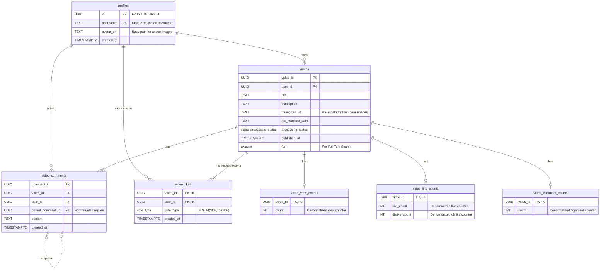

# Younivi: A Scalable, Cloud-Native Sharing Platform

<div align="center">
    
</div>

<p align="center">
    <strong>A modern, cloud-native, and scalable contents sharing platform built from the ground up.</strong>
</p>
<p align="center">
    This repository documents the architecture and development of Younivi, a platform engineered to serve as a showcase of modern software engineering principles for building large-scale, high-available, and performant services.
</p>

---

## Live Demo

**[https://younivi.com](https://younivi.com)**

---

## Project Status

The project is currently under **active development**. While the application is functional, it is not yet production-ready. It currently only supports video uploads and playback, with many features still in progress. The architecture is designed to be scalable and maintainable, with a focus on best practices in software engineering.

---

## Key Features

-   **Secure Authentication**: Complete auth flow (sign-up, login, password recovery) with email verification via a self-hosted Apache James mail server.
-   **Asynchronous Media Transcoding**: Resilient, non-blocking video and image processing pipeline.
-   **Adaptive HLS Streaming**: Efficient video delivery using HLS with modern codecs: **AV1** for 1080p+ and **H.264** for lower resolutions.
-   **Responsive Image Optimization**: Serves **AVIF** images with **JPEG** fallbacks for thumbnails and avatars, optimizing for performance and quality.
-   **Full-Text Search**: Fast and relevant search across video titles and descriptions.
-   **Custom React Video Player**: A feature-rich, fully custom video player with keyboard shortcuts, adaptive quality switching, and a modern UI.
-   **Scalable & Resilient Infrastructure**: Built on a self-hosted Kubernetes cluster and managed entirely through GitOps principles with ArgoCD.

---

## Tech Stack & Architecture

Younivi is built with a microservices-oriented architecture, leveraging open-source software within a Kubernetes environment.


| Category      | Technologies                                                                                                                                                                                                                                                                                             |
|---------------|----------------------------------------------------------------------------------------------------------------------------------------------------------------------------------------------------------------------------------------------------------------------------------------------------------|
| **Frontend**  |     |
| **Backend**   |     |
| **Data Layer**|     |
| **Platform**  |     |
| **DevOps**    |       |


### System Architecture Diagram

This diagram provides a high-level overview of how the different services interact within the Kubernetes cluster.



### Video Processing Flow

The video processing pipeline is fully asynchronous, ensuring the API remains responsive and the system is resilient to processing failures.



### Database Schema (ERD)

The database schema is built on PostgreSQL, leveraging its powerful features like Row-Level Security (RLS), triggers, and functions (RPC).



---

## Key Architectural Decisions & Highlights

This section details some of the specific engineering choices made to ensure the platform is scalable, secure and maintainable.

-   **Asynchronous Processing**: The use of **RabbitMQ** as a message broker is critical to the architecture. It decouples the user-facing API from heavy background tasks like video transcoding. This means a user gets an instant response after uploading, and processing failures in a worker won't crash the API. Workers acknowledge messages only after successful processing or permanently fail them, preventing job loss.

-   **Performant Database Design**:
    -   **Concrete Tables over Polymorphism**: Instead of a generic `likes` table, the schema uses specific tables like `video_likes`. This allows for stronger foreign key constraints, simpler queries, and more efficient indexing, which is crucial for performance in PostgreSQL at scale. Although polymorphic associations can be flexible, they often lead to complex queries and performance issues as the dataset grows.
    -   **Counter Caching with Triggers**: Aggregate counts (likes, comments, views) are pre-calculated by database triggers and stored in separate, denormalized `*_counts` tables. This avoids expensive `COUNT(*)` queries on large tables for every page load, dramatically improving read performance for high-traffic pages. A database `VIEW` then joins these counters for easy querying.
    -   **RPC for Atomic Business Logic**: Complex operations, like updating a username across multiple tables (`profiles` and `auth.users`), are encapsulated in atomic PostgreSQL functions (`RPC`). This ensures data consistency and centralizes business logic within the database.

-   **Resilience and Maintenance**:
    -   **Abandoned Upload Cleanup**: A Kubernetes `CronJob` runs periodically to find and delete stale `pending` video records and their associated orphaned files in object storage. This prevents storage bloat from incomplete uploads. In a future iteration, a more sophisticated cleanup strategy could be implemented, such as using a `TTL` (Time-To-Live) policy.
    -   **Worker Design**: Transcoding workers are designed to be stateless and idempotent. They can be scaled horizontally, and if one fails, another can pick up the job without losing progress. This is crucial for maintaining high availability and reliability in a production environment.

-   **Optimized Frontend Experience**:
    -   **Custom Video Player**: The custom-built player avoids heavy third-party libraries and provides complete control over the user experience. By using React Portals (via custom `PlayerTooltip` and `PlayerDropdownMenu` components), it solves the common issue of UI elements being trapped inside the player's container during fullscreen mode.
    -   **Responsive Images**: The frontend uses `<picture>` tags with AVIF and JPEG sources, combined with `srcset` and `sizes`, ensures the browser downloads the most optimal image format and size, significantly improving page load times and reduces bandwidth.

---

## Deployment Guide

Deploying Younivi is a multi-stage process that involves setting up a production-grade Kubernetes environment from scratch and then layering services on top of it. This guide breaks down the deployment into logical phases, explaining not just the steps but also the architectural reasoning behind the choice of tools.

### Prerequisites

*   A set of servers (VMs or bare metal) to act as Kubernetes nodes.
*   A domain name (e.g., `younivi.com`) with DNS management access.
*   `kubectl` installed and configured on your local machine.

---

### Phase 1: The Kubernetes Setup

This phase establishes the highly available cluster on which all other services will run.

**1. Deploy the Kubernetes Cluster with Kubekey**

Use `KubeKey` to bootstrap the cluster. The configuration is defined in [config-sample.yaml](/codes/kubekey/configs/config-sample.yaml).

*   **Why Kubekey?** It simplifies the setup of a multi-master, highly available Kubernetes cluster, automating the complex configuration of etcd, the API Server, and networking.

```bash
# Example command to create the cluster
kk create cluster -f config-sample.yaml
```

**Configuration Details**
*   **HAProxy**: Deployed by Kubekey. HAProxy acts as a load balancer for the Kubernetes API server across all control-plane nodes. This is the key component of high availability, ensuring that the cluster remains manageable even if one master node fails.
*   **containerd**: Chosen as the container runtime because it's the industry standard, a lightweight, and efficient runtime. CRI-O is also a valid alternative, but containerd is more widely adopted and has better community support.
*   **Calico**: A powerful and high-performance networking and network policy provider. It was chosen for its native support for **WireGuard encryption**. This ensures an encrypted pod-to-pod communication overlay across the cluster, securing all internal traffic by default. Cilium can also be used as an alternative. They both provide excellent performance and security features.

---

### Phase 2: Core Cluster Services

With the cluster running, install the essential services for management, security, and observability.

**2. Deploy ArgoCD for GitOps**

ArgoCD is installed in the cluster. It will be responsible for deploying and managing all subsequent applications.

*   ArgoCD enforces a **GitOps workflow**, where the Git repository becomes the single source of truth for the desired state of the cluster. This provides a clear maintenance, simplifies rollbacks, and automates deployments. All manifests in this repository are structured for ArgoCD.

**3. Deploy HashiCorp Vault and Other Basic Applications**

Next, deploy Vault, Cert-Manager, an Ingress Controller, and monitoring tools.

**Why these tools?**
*   **HashiCorp Vault**: Vault provides a secure, centralized secret management system. **`argocd-vault-plugin`** allows ArgoCD to securely and dynamically inject secrets into Kubernetes manifests just before they are applied, maintaining a strong security posture. Visit [Argo CD Vault Plugin](https://argocd-vault-plugin.readthedocs.io/en/stable/) for more details.
*   **Cert-Manager**: Automates the management and issuance of TLS certificates from sources like Let's Encrypt.
*   **Apache APISIX**: A high-performance, cloud-native API Gateway that serves as our Ingress Controller. Its plugin-based architecture provides flexibility for routing, authentication, and traffic management. It is used to route traffic to the frontend, the backend API, and the Supabase BaaS endpoint based on hostname. Nginx Ingress Controller is a valid alternative, but APISIX offers more advanced features and better performance for the current use case.
*   **Prometheus & Grafana**: The de facto standard for monitoring and observability in the Kubernetes ecosystem. Prometheus scrapes metrics from all services, and Grafana provides dashboards to visualize system health and performance.

---

### Phase 3: Stateful Services & Dependencies

Set up the data persistence and messaging layers.

**4. Deploy CloudNativePG (PostgreSQL Operator)**

CloudNativePG operator takes care of deploying and managing PostgreSQL clusters on Kubernetes.

**Why CloudNativePG?**
*   It follows the **Operator pattern**, which extends Kubernetes with custom logic for managing complex stateful applications. Instead of manually managing PostgreSQL, it allows declarative definition of the database clusters (e.g., replicas, backups, failover) in YAML, and the operator handles the rest. This is crucial for running a database on Kubernetes.

**5. Deploy SeaweedFS (S3-Compatible Object Storage)**

SeaweedFS is deployed for storing all media files (videos, thumbnails, avatars). Its filer component is configured to use a PostgreSQL database for metadata storage.

SeaweedFS is a highly scalable, performant, and S3-compatible object storage system. Its architecture separates metadata (the "filer") from data (the "volume servers"), which is excellent for performance.

**6. Deploy Apache James Dependencies**

RabbitMQ, Cassandra, and OpenSearch are deployed as dependencies for the Apache James mail server.

These are the required, scalable backend components for running a production-grade **Apache James** mail server. RabbitMQ handles mail queues, Cassandra stores mailbox data, and OpenSearch provides powerful search capabilities for mail content.

**7. Deploy Apache James (Mail Server)**

The Apache James mail server is deployed. Self-hosting a powerful mail server like James provides complete control over the transactional email delivery (e.g., account confirmation, password resets). It avoids reliance and costs associated with third-party email services and integrates directly into the infrastructure.

**8. Deploy Harbor (Container Registry)**

Harbor is deployed to serve as a private container registry. Harbor provides a private, secure registry hosted within the Kubernetes cluster. It includes features like vulnerability scanning, access control, and image replication, which are essential for a secure software supply chain.

---

### Phase 4: The Application Layer

Finally, with all the infrastructure and dependencies in place, deploy the main applications that make up the Younivi platform.
*   **`younivi-frontend` (Next.js)**: Next.js was chosen for its excellent developer experience and powerful features. It enables a hybrid approach of server-rendered components (for SEO and fast initial loads) and interactive client components. Its built-in optimization and standalone output mode are perfect for containerized deployments.

**9. Deploy Supabase, Younivi Backend, and Younivi Frontend**
*   **Supabase (self-hosted)**: It was deployed using its community Helm chart to get the power of a Backend-as-a-Service (BaaS) for auto-generated APIs, authentication (GoTrue), and storage integrations while retaining full control over the underlying database and infrastructure. This gives the best of both worlds: rapid development and deployment.
*   **`younivi-backend` (Microservices)**: The backend is split into a user-facing **API server** and several **worker** deployments. This follows a microservice pattern. The API server handles lightweight, synchronous requests (like generating a signed URL), while the heavy, long-running tasks (video transcoding, image processing) are offloaded to dedicated workers via RabbitMQ. This allows independent scaling of the API and worker services.
*   **`younivi-frontend` (Next.js)**: Next.js was chosen for its excellent developer experience and powerful features. It enables a hybrid approach of server-rendered components (for SEO and fast initial loads) and interactive client components. Its built-in optimization and standalone output mode are perfect for containerized deployments.

---

## License

This project is licensed under the **Apache-2.0 License**. See the `LICENSE` file for details.

---

## Contact

Joon Young Baik - [baikjy0215@gmail.com](mailto:baikjy0215@gmail.com)

Project Link: [https://github.com/baikjy0215/scalable-sharing-platform](https://github.com/baikjy0215/scalable-sharing-platform)

Feel free to reach out with any questions or feedback!